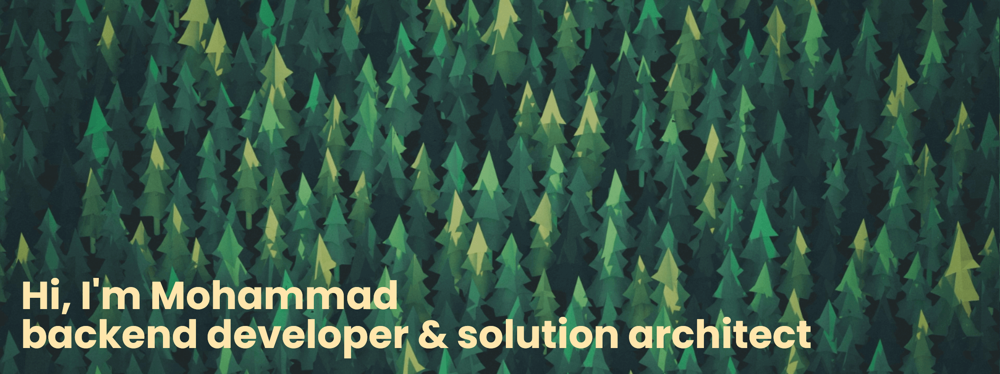

# mohammadne 🌳

<!-- HEADER -->
[](https://github.com/mohammadne)

<!-- BADGES -->
<p align="center">
	<a href="https://github.com/mohammadne/mohammadne/blob/master/resume.pdf">
  		
	</a>
	<a href="https://github.com/1995parham">
  		
	</a>
</p>

```go
aboutMe := map[string]interface{}{
	"name":            "Mohammad",
	"profession":      "Software Engineer",
	"location":        "Iran",
	"university":      "Amirkabir university of Technology",
	"currentPosition": "Snapp!, the biggest online taxi service provider in Iran",
	"languages":       []string{"Go", "Rust", "Python", "SQL"},
	"frameworks":      []string{"Flask", "Laravel"},
	"databases":       []string{"SQLserver", "PostgreSQL", "MySQL", "MongoDB"},
	"interests":       []string{"software design", "machine learning", "algorithms", "cloud"},
	"design":          []string{"Clean Architecture", "Microservices"},
	"tools":           []string{"Kubernetes", "Docker", "Vim", "Git"},
	"systems":         []string{"Linux", "MacOs"},
}
``` 

## Statistics

<p align = "center">
  
  
</p>

<p align = "center">
 
</p> 

<!-- <p align = "center">
  
</p>  -->


## Contact Me

[](mailto:mohammadne@mail.ru)
[](https://www.linkedin.com/in/mohammadne/)
